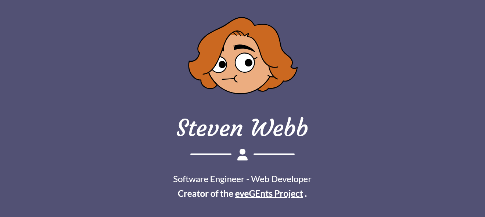

<!--

-->

###

<h2 align="left" style="color: #525174;"><b>About me</b></h2>

###

    🐛 Creating bugs since 2018 
    🎓 Graduated from the <a href="https://www.anu.edu.au/">Australian National University</a>, Master of Computing 
    🤔 I'm currently learning ReactJS and ASP.NET 
    🎯 Goals: Become a Full stack developer 

###

<h2 align="left" style="color: #525174;"><b>I code with...</b></h2>

👨‍💻 Programming Languages

    
    
    
    
    
    
    
    
    
    
    
     &nbsp;

 

🕸️ Web Development

    
    
    
    
    
    
    <!--
    
    
    -->
    
    
    
    
    
    
    
    
    
     &nbsp;

🤖 Machine Learning

    
    
    
    
    
        
       
        
    
     &nbsp;

 

🗄️ Databases

    
    
    
         
    
     &nbsp;

 

🛠️ Dev Tools & System Management

    
    
    
    
    
      
    
      
       
       
    
    
    
        
    
     &nbsp;

###

<h2 align="left" style="color: #525174;"><b>Stats</b></h2>

###

<h2 align="left" style="color: #525174;"><b>About this Repo</b></h2>

This repository also contains [my personal website](https://stewebb.evegents.net), which is powered by [Start Bootstrap - Freelancer](https://github.com/StartBootstrap/startbootstrap-freelancer) theme.

###